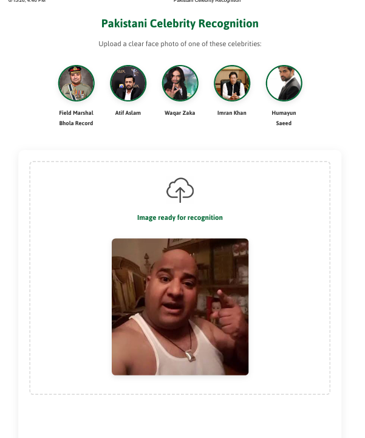

[](https://www.python.org/downloads/)
[](https://flask.palletsprojects.com/)
[](https://opencv.org/)
[](https://numpy.org/)
[](https://joblib.readthedocs.io/)
[](LICENSE)
[](https://github.com/devbabarsultan/pakistani-celebrity-recognition)

###
# Pakistan celebrity recognition web app that identifies a celebrity from an uploaded face photo using a trained ML model.
###
## Built with Flask + OpenCV for face detection, preprocessing, and fast in-browser uploads.
###

---

## Features

- Upload an image (drag & drop or browse)
- Face detection and cropping (requires at least 2 detected eyes)
- Predict celebrity identity using the trained model
- Responsive UI with preview and result view

---

## Project Structure

- `flask_server/` — Flask backend + frontend assets (templates, static files)
  - `server.py` — Flask app entry point
  - `utils.py` — Image decoding, face cropping, and model inference
  - `templates/` — `index.html`, `result.html`, `error.html`
  - `static/` — `style.css`, `script.js`, and images/icons
- `building_model/` — Jupyter notebooks for training/model preparation
- `celebrity_recognition_model.pkl` — Trained model (loaded by backend)
- `class_dict.json` — Class index/name mapping

---

## How It Works

1. The frontend sends the uploaded image to the Flask API as a Base64 string.
2. Backend decodes the image, detects a face, and crops it.
3. Cropping is validated by detecting **at least two eyes**.
4. The cropped face is preprocessed and fed into the ML model.
5. The predicted class is mapped to the celebrity name and returned.

---

## Running the App Locally

### 1) Prerequisites

- Python 3.9+
- Required dependencies (see next section)

### 2) Install Dependencies

Install packages required for Flask + ML/image processing.

```bash
pip install flask opencv-python numpy joblib pywavelets
```

> Note: If you already have a `requirements.txt` in your project, use it instead.

### 3) Start the Server

From the project root:

```bash
python flask_server/server.py
```

Then open:

- http://127.0.0.1:5000

---

## Screenshots / UI Preview

### Frontend Image


### Frontend HTML (static mode)
If you want to take a screenshot without running Flask, open:
- `flask_server/templates/index.static.html`

(Then capture the rendered page styling.)

---

## Usage

1. Open the app in your browser.
2. Drag and drop a clear face photo of one of the supported celebrities.
3. Click **Recognize Face**.
4. View the predicted identity.

---

## Model Files

The backend loads:

- `flask_server/artifects/celebrity_recognition_model.pkl`
- `flask_server/artifects/class_dict.json`

---

## Limitations

- Performance depends heavily on image quality and face visibility.
- Images must be clear enough for the face detector.
- At least **two eyes** must be detected for cropping.

---

## Technologies Used

- Flask (backend web server)
- OpenCV (face/eye detection)
- NumPy (array processing)
- joblib (model loading)
- ML model (`.pkl`)
- Frontend: HTML/CSS/JavaScript

---

## License

**All rights reserved**.

